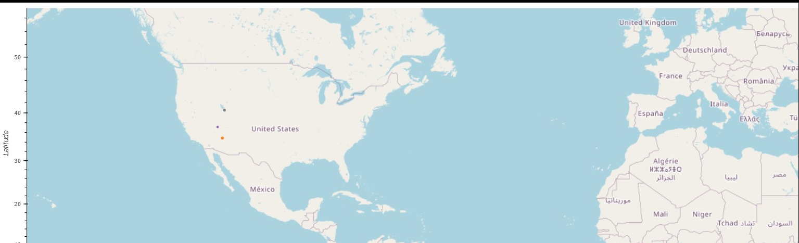

# Weather API Analysis

## Website: 
[website](https://github.com/Damiomo/Python-API-Analysis)

## Description
In order to prove that temperature gets hotter as we get closer to de equator, I collected current weather conditions from over 500 random cities around the world. We did this with the use of OpenWeatherMap API.  Then, I evaluated temperature, cloudiness, humidity and wind speed.  On part two of this project, I filter cities with ideal weather conditions and used I used the Places API from Geoapify.

## Table of Contents
- [Installation](#installation)
- [Usage](#usage)
- [Credits](#credits)
- [License](#license)
- [Features](#features)

- [Contact](#contact)

## Installation
Python, Pandas and Requests

## Usage
Run the ipynb file

## Credits
Damilare Omoboriowo

## License
MIT

## Features
It provides prove that temperature gets hotter as we get closer to the equator.

## Contact
If there are any questions or concerns, I can be reached at:
##### [github: Damiomo](https://github.com/Damiomo)
##### [email: domoboriowo14@gmail.com](mailto:domoboriowo14@gmail.com)
